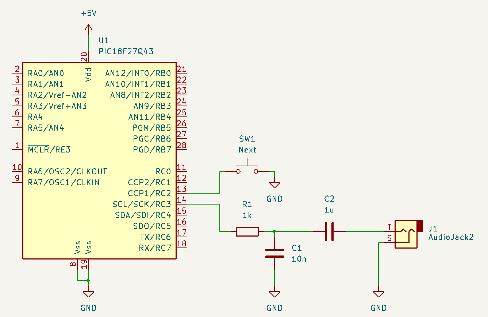

# music-box
Electronic music box with PIC18F27Q43
This 4-channel electronic music box produces an attenuated sine wave and sounds like a mechanical music box.
DDS is implemented using waveform tables to reduce the computational load.  
This project was created using MPLAB X IDE v6.20, XC8 v2.46, and MCC v5.50.  
For more information, please visit [this site.](https://ice458.wordpress.com/%e9%9b%bb%e5%ad%90%e3%82%aa%e3%83%ab%e3%82%b4%e3%83%bc%e3%83%ab/)

  

## License

The files contained in [music_box.X/mcc_generated_files](music_box.X/mcc_generated_files) are copyrighted by Microchip. The code can only be used in Microchip products. Please refer to the comments at the top of the files for details.

Other files are subject to the overall license [LICENSE](LICENSE).
